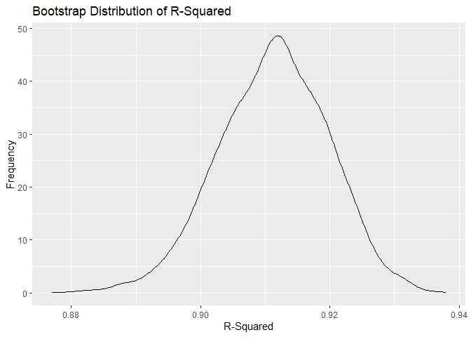
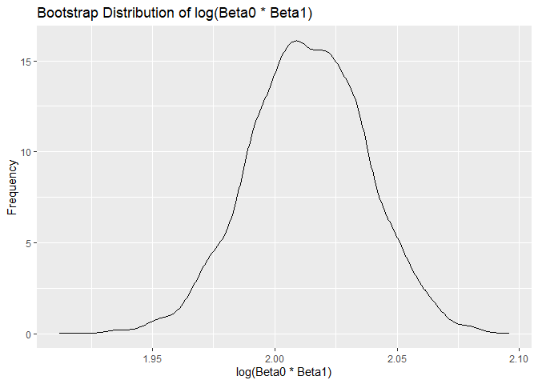

HW6
================
Tianqi Li
2024-12-02

``` r
library(tidyverse)
```

    ## ── Attaching core tidyverse packages ──────────────────────── tidyverse 2.0.0 ──
    ## ✔ dplyr     1.1.4     ✔ readr     2.1.5
    ## ✔ forcats   1.0.0     ✔ stringr   1.5.1
    ## ✔ ggplot2   3.5.1     ✔ tibble    3.2.1
    ## ✔ lubridate 1.9.3     ✔ tidyr     1.3.1
    ## ✔ purrr     1.0.2     
    ## ── Conflicts ────────────────────────────────────────── tidyverse_conflicts() ──
    ## ✖ dplyr::filter() masks stats::filter()
    ## ✖ dplyr::lag()    masks stats::lag()
    ## ℹ Use the conflicted package (<http://conflicted.r-lib.org/>) to force all conflicts to become errors

## Problem 1

``` r
weather_df = 
  rnoaa::meteo_pull_monitors(
    c("USW00094728"),
    var = c("PRCP", "TMIN", "TMAX"), 
    date_min = "2017-01-01",
    date_max = "2017-12-31") %>%
  mutate(
    name = recode(id, USW00094728 = "CentralPark_NY"),
    tmin = tmin / 10,
    tmax = tmax / 10) %>%
  select(name, id, everything())
```

    ## using cached file: C:\Users\ltquc\AppData\Local/R/cache/R/rnoaa/noaa_ghcnd/USW00094728.dly

    ## date created (size, mb): 2024-10-16 15:12:29.471384 (8.67)

    ## file min/max dates: 1869-01-01 / 2024-10-31

Create the bootstrap samples

``` r
boot_straps = 
  weather_df |>
  modelr::bootstrap(5000) |>
  mutate(
    strap = map(strap, as_tibble),
    models = map(strap, \(df) lm(tmax~tmin, data = df)),
    glance = map(models, broom::glance), 
    results = map(models, broom::tidy)
  ) |>
  unnest(glance) |>
  select(.id, r.squared, results) |>
  unnest(results) |>
  select(.id, r.squared, term, estimate) |>
  pivot_wider(names_from = term, values_from = estimate) |>
  rename(
    beta0 = `(Intercept)`,
    beta1 = tmin
  ) |>
  mutate(log = log(beta0 * beta1))
```

Plot the distribution

``` r
boot_straps |>
  ggplot(aes(x = r.squared)) +
  geom_density() +
  ggtitle("Bootstrap Distribution of R-Squared") +
  xlab("R-Squared") +
  ylab("Frequency")
```

<!-- -->

``` r
boot_straps |>
  ggplot(aes(x = log)) +
  geom_density() +
  ggtitle("Bootstrap Distribution of log(Beta0 * Beta1)") +
  xlab("log(Beta0 * Beta1)") +
  ylab("Frequency")
```

<!-- -->

R-squared distributed between 0.89 to 0.93 with peak at about 0.915.  
log distributed between about 1.99 to 2.06 with peak about 2.01.

``` r
boot_straps |>
  summarise(
    r2_ci_ll = quantile(r.squared, .025),
    r2_ci_ul = quantile(r.squared, .975),
    log_ci_ll = quantile(log, .025),
    log_ci_ul = quantile(log, .975)
  )
```

    ## # A tibble: 1 × 4
    ##   r2_ci_ll r2_ci_ul log_ci_ll log_ci_ul
    ##      <dbl>    <dbl>     <dbl>     <dbl>
    ## 1    0.894    0.927      1.97      2.06
