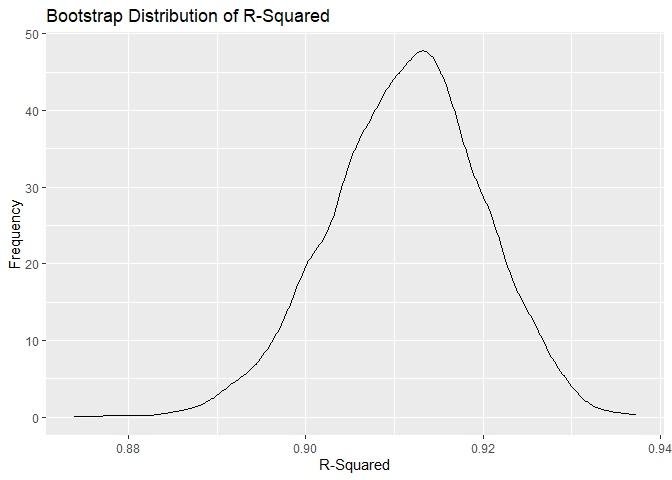
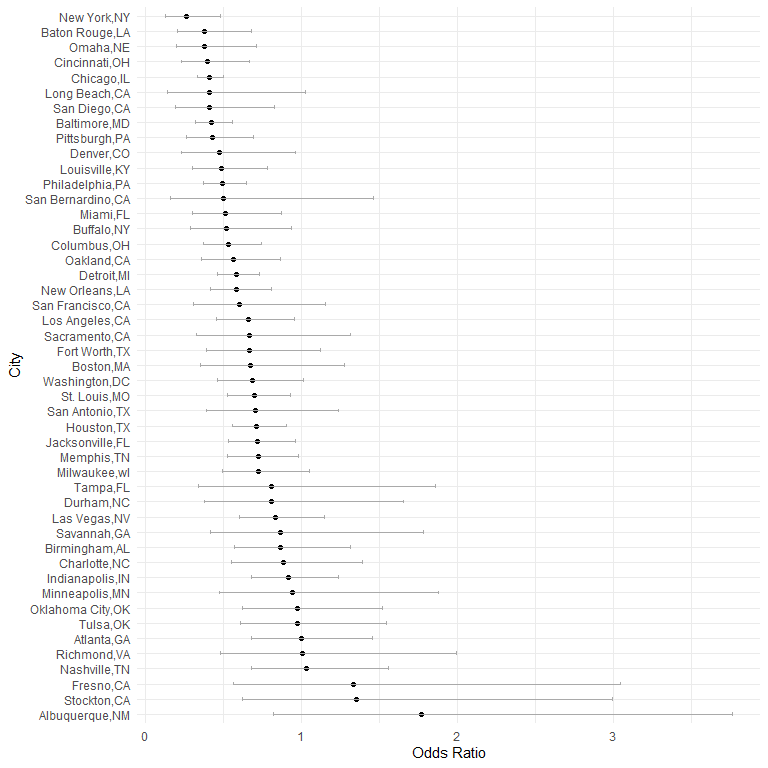
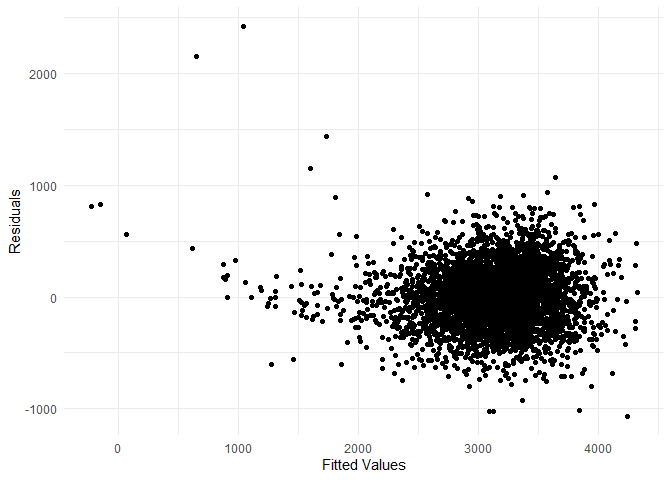
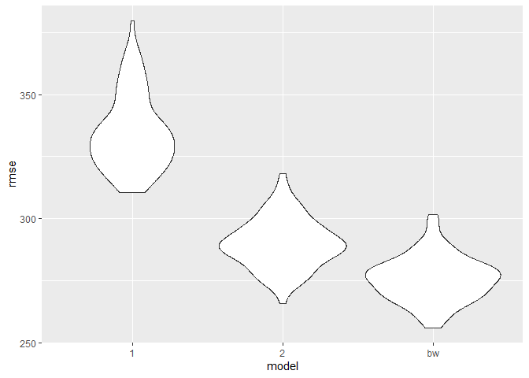

HW6
================
Tianqi Li
2024-12-02

``` r
library(tidyverse)
library(modelr)
library(mgcv)
library(SemiPar)
set.seed(1)
```

## Problem 1

``` r
weather_df = 
  rnoaa::meteo_pull_monitors(
    c("USW00094728"),
    var = c("PRCP", "TMIN", "TMAX"), 
    date_min = "2017-01-01",
    date_max = "2017-12-31") %>%
  mutate(
    name = recode(id, USW00094728 = "CentralPark_NY"),
    tmin = tmin / 10,
    tmax = tmax / 10) %>%
  select(name, id, everything())
```

Create the bootstrap samples

``` r
boot_straps = 
  weather_df |>
  modelr::bootstrap(5000) |>
  mutate(
    strap = map(strap, as_tibble),
    models = map(strap, \(df) lm(tmax~tmin, data = df)),
    glance = map(models, broom::glance), 
    results = map(models, broom::tidy)
  ) |>
  unnest(glance) |>
  select(.id, r.squared, results) |>
  unnest(results) |>
  select(.id, r.squared, term, estimate) |>
  pivot_wider(names_from = term, values_from = estimate) |>
  rename(
    beta0 = `(Intercept)`,
    beta1 = tmin
  ) |>
  mutate(log = log(beta0 * beta1))
```

Plot the distribution

``` r
boot_straps |>
  ggplot(aes(x = r.squared)) +
  geom_density() +
  ggtitle("Bootstrap Distribution of R-Squared") +
  xlab("R-Squared") +
  ylab("Frequency")
```

<!-- -->

``` r
boot_straps |>
  ggplot(aes(x = log)) +
  geom_density() +
  ggtitle("Bootstrap Distribution of log(Beta0 * Beta1)") +
  xlab("log(Beta0 * Beta1)") +
  ylab("Frequency")
```

<!-- -->

R-squared distributed between 0.87 to 0.94 with peak at about 0.915.  
log distributed between about 1.90 to 2.10 with peak about 2.02.

``` r
boot_straps |>
  summarise(
    r2_ci_ll = quantile(r.squared, .025),
    r2_ci_ul = quantile(r.squared, .975),
    log_ci_ll = quantile(log, .025),
    log_ci_ul = quantile(log, .975)
  )
```

    ## # A tibble: 1 × 4
    ##   r2_ci_ll r2_ci_ul log_ci_ll log_ci_ul
    ##      <dbl>    <dbl>     <dbl>     <dbl>
    ## 1    0.894    0.927      1.96      2.06

## Problem 2

Load the dataset

``` r
data_url = "https://raw.githubusercontent.com/washingtonpost/data-homicides/master/homicide-data.csv"

homicide_data = read_csv(data_url)
```

Create the city_state variable and filter the dataset

``` r
homicide_df = 
  homicide_data |>
    mutate(
    city_state = paste(city, state, sep = ","),
    solved = ifelse(disposition == "Closed by arrest", 1, 0)
    ) |>
  filter(!(city_state %in% c("Dallas,TX","Phoenix,AZ","Kansas City,MO","Tulsa,AL"))) |>
  filter(victim_race %in% c("White","Black")) |>
  mutate(victim_age = as.numeric(victim_age))
```

Focus on Baltimore city

``` r
baltimore_test <- 
  homicide_df |>
  filter(city_state == "Baltimore,MD") |>
  glm(solved ~ victim_age + victim_sex + victim_race, family = "binomial", 
      data = _) |>
  broom::tidy(conf.int = TRUE, conf.level = 0.95) |>
  mutate(
    OR = exp(estimate),
    lower = exp(conf.low),
    upper = exp(conf.high)
  ) |>
  filter(term == "victim_sexMale") |>
  select(OR, lower, upper)
baltimore_test |>
  knitr::kable(digits = 3)
```

|    OR | lower | upper |
|------:|------:|------:|
| 0.426 | 0.324 | 0.558 |

For each cities

``` r
city_tests <- 
  homicide_df |>
  group_by(city_state) |>
  nest() |>
  mutate(
    fit = map(
      data, ~ glm(solved ~ victim_age + victim_race + victim_sex, data = ., family = binomial())
      ),
    results = map(fit, ~ broom::tidy(.x, conf.int = TRUE, conf.level = 0.95))
  ) |>
  unnest(results) |>
  mutate(
    OR = exp(estimate),
    lower = exp(conf.low),
    upper = exp(conf.high)
  ) |>
  filter(term == "victim_sexMale") |>
  select(city_state, OR, lower, upper)
    
city_tests |>
  knitr::kable(digits = 3)
```

| city_state        |    OR | lower | upper |
|:------------------|------:|------:|------:|
| Albuquerque,NM    | 1.767 | 0.825 | 3.762 |
| Atlanta,GA        | 1.000 | 0.680 | 1.458 |
| Baltimore,MD      | 0.426 | 0.324 | 0.558 |
| Baton Rouge,LA    | 0.381 | 0.204 | 0.684 |
| Birmingham,AL     | 0.870 | 0.571 | 1.314 |
| Boston,MA         | 0.674 | 0.353 | 1.277 |
| Buffalo,NY        | 0.521 | 0.288 | 0.936 |
| Charlotte,NC      | 0.884 | 0.551 | 1.391 |
| Chicago,IL        | 0.410 | 0.336 | 0.501 |
| Cincinnati,OH     | 0.400 | 0.231 | 0.667 |
| Columbus,OH       | 0.532 | 0.377 | 0.748 |
| Denver,CO         | 0.479 | 0.233 | 0.962 |
| Detroit,MI        | 0.582 | 0.462 | 0.734 |
| Durham,NC         | 0.812 | 0.382 | 1.658 |
| Fort Worth,TX     | 0.669 | 0.394 | 1.121 |
| Fresno,CA         | 1.335 | 0.567 | 3.048 |
| Houston,TX        | 0.711 | 0.557 | 0.906 |
| Indianapolis,IN   | 0.919 | 0.678 | 1.241 |
| Jacksonville,FL   | 0.720 | 0.536 | 0.965 |
| Las Vegas,NV      | 0.837 | 0.606 | 1.151 |
| Long Beach,CA     | 0.410 | 0.143 | 1.024 |
| Los Angeles,CA    | 0.662 | 0.457 | 0.954 |
| Louisville,KY     | 0.491 | 0.301 | 0.784 |
| Memphis,TN        | 0.723 | 0.526 | 0.984 |
| Miami,FL          | 0.515 | 0.304 | 0.873 |
| Milwaukee,wI      | 0.727 | 0.495 | 1.054 |
| Minneapolis,MN    | 0.947 | 0.476 | 1.881 |
| Nashville,TN      | 1.034 | 0.681 | 1.556 |
| New Orleans,LA    | 0.585 | 0.422 | 0.812 |
| New York,NY       | 0.262 | 0.133 | 0.485 |
| Oakland,CA        | 0.563 | 0.364 | 0.867 |
| Oklahoma City,OK  | 0.974 | 0.623 | 1.520 |
| Omaha,NE          | 0.382 | 0.199 | 0.711 |
| Philadelphia,PA   | 0.496 | 0.376 | 0.650 |
| Pittsburgh,PA     | 0.431 | 0.263 | 0.696 |
| Richmond,VA       | 1.006 | 0.483 | 1.994 |
| San Antonio,TX    | 0.705 | 0.393 | 1.238 |
| Sacramento,CA     | 0.669 | 0.326 | 1.314 |
| Savannah,GA       | 0.867 | 0.419 | 1.780 |
| San Bernardino,CA | 0.500 | 0.166 | 1.462 |
| San Diego,CA      | 0.413 | 0.191 | 0.830 |
| San Francisco,CA  | 0.608 | 0.312 | 1.155 |
| St. Louis,MO      | 0.703 | 0.530 | 0.932 |
| Stockton,CA       | 1.352 | 0.626 | 2.994 |
| Tampa,FL          | 0.808 | 0.340 | 1.860 |
| Tulsa,OK          | 0.976 | 0.609 | 1.544 |
| Washington,DC     | 0.690 | 0.465 | 1.012 |

Plot estimated ORs and CIs

``` r
city_tests |>
  ggplot(aes(x = reorder(city_state,desc(OR)), y = OR)) +
  geom_point() +
  geom_errorbar(aes(ymin = lower, ymax = upper), width = 0.25, color = "darkgray") +
  labs(
    x = "City",
    y = "Odds Ratio"
  ) +
  coord_flip() +
  theme_minimal()
```

<!-- -->

## Problem 3

Load the dataset and clean it

``` r
bw_df = 
  read_csv("birthweight.csv") |>
  janitor::clean_names() |>
  mutate(
    babysex = factor(babysex, levels = c(1, 2), 
                     labels = c("Male", "Female")),
    malform = factor(malform, levels = c(0, 1), 
                     labels = c("Absent", "Present")),
    frace = factor(frace, levels = c(1, 2, 3, 4, 8, 9), 
                   labels = c("White", "Black", "Asian", "Puerto Rican", "Other", "Unknown")),
    mrace = factor(mrace, levels = c(1, 2, 3, 4, 8), 
                   labels = c("White", "Black", "Asian", "Puerto Rican", "Other"))
  )
```

Modeling Process  
Data Cleaning: Variable names were cleaned. Meaningful labels were
created for factor variables (e.g., babysex, malform) rather than
numbers. No missing values in the dataset.

``` r
bw_model = 
  lm(
  bwt ~ babysex + bhead + blength + fincome + frace + gaweeks + malform + momage  + ppbmi + smoken + wtgain, data = bw_df
  )
```

Variables were chosen based on the hypothesized biological and
socio-economic factors influencing birth weight. My proposed model for
birthweight includes the following variables: babysex, bhead, blength,
fincome, frace, gaweeks, malform, momage, ppbmi, smoken, wtgain.
Variables like bhead, blength, and gaweeks directly measure or predict
the baby’s growth, making them essential for modeling birth weight.
Variables like fincome and frace provide insight into socio-economic
factors that indirectly affect birthweight. Pre-pregnancy BMI, and
weight gain during pregnancy are key indicators of maternal health and
directly influence fetal growth.Previous complications increase the risk
of similar outcomes. These variables are all predictive of birthweight.

Plot residuals vs fitted values

``` r
bw_df =
  bw_df |>
  modelr::add_predictions(bw_model) |>
  modelr::add_residuals(bw_model)
bw_df |>
  ggplot(aes(x = pred, y = resid)) +
  geom_point() +
  labs(
    x = "Fitted Values",
    y = "Residuals"
  ) +
  theme_minimal()
```

<!-- -->

Model comparison

``` r
cv_df = 
  crossv_mc(bw_df, 100) |>
  mutate(
    train = map(train, as_tibble),
    test = map(test, as_tibble)
  ) |>
  mutate(
    bw_mod = map(train, \(x) lm(bwt ~ babysex + bhead + blength + fincome + frace + gaweeks + malform + momage  + ppbmi + smoken + wtgain, data = x)),
    model1 = map(train, \(x) lm(bwt ~ blength + gaweeks, data = x)),
    model2 = map(train, \(x) lm(bwt ~ bhead * blength * babysex, data = x))
  ) |>
  mutate(
    rmse_bw = map2_dbl(bw_mod, test, rmse),
    rmse_1 = map2_dbl(model1, test, rmse),
    rmse_2 = map2_dbl(model2, test, rmse)
  )

cv_df |>
  select(starts_with("rmse")) |>
  pivot_longer(
    everything(),
    names_to = "model",
    values_to = "rmse",
    names_prefix = "rmse_"
  ) |>
  ggplot(aes(x = model, y = rmse)) +
  geom_violin()
```

<!-- -->

Model 1 uses only blength and gaweeks as predictors and has the highest
RMSE, indicating it is the least accurate among the three models. Only
including two variables in the model likely to oversimplify the
relationship.

The interaction model performs better than Model 1, as shown by its
lower RMSE. Including interactions between bhead, blength, and babysex
adds complexity and captures additional variability in birthweight.

The model proposed by myself has the lowest RMSE, suggesting consistent
performance across cross-validation folds. It performs best likely
because it incorporates a mix of biological, maternal, and socioeconomic
predictors.
